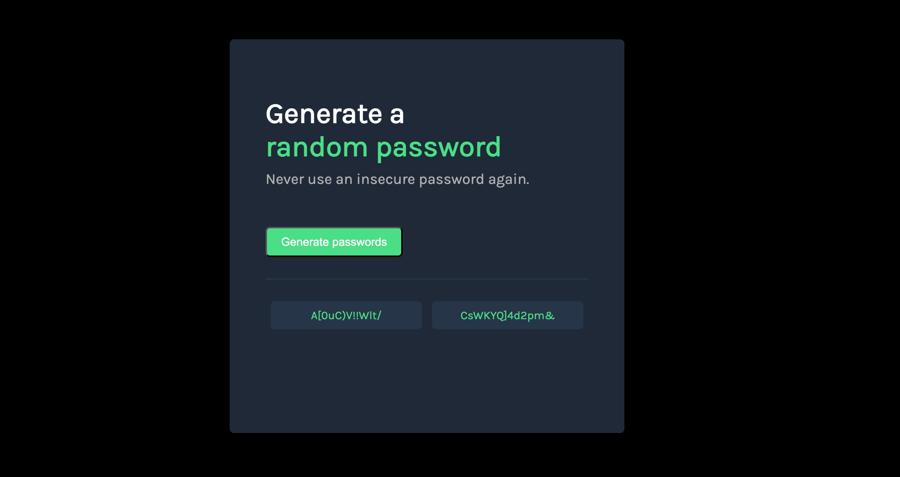

## Password Generator

## Overview

A simple, interactive password generator built with HTML, CSS, and JavaScript. Users can generate a random password, see it displayed in a box, and copy it to the clipboard by clicking the box. The interface includes dynamic styling, cursor changes, and subtle animations for enhanced user experience.

## Features

Generate random passwords of 13 characters

Clickable password boxes that copy the password to the clipboard

Cursor changes to a pointer only when a password exists

Subtle animation when a new password is generated

Clean and responsive design

Installation

## Clone the repository:

git clone https://github.com/buildinrythm/random-password-generator

Open index.html in your preferred browser.

Usage

Click the "Generate Password" button to create a new password.

Click on the password box to copy the password to your clipboard (cursor changes to indicate clickability).

Enjoy dynamically styled and animated password generation.

## Screenshot

Learnings & Development Process

Planning Logic: Sketched the steps on paper before coding to clarify the workflow.

Starting Small: Generated a single random character before scaling to full passwords.

Loops: Improved understanding of loops — start, end, and increments — making password construction intuitive.

Functions: Broke the project into three key functions:

genRandomChar() – returns a random character

generatePassword() – constructs a full password

renderPasswords() – updates the password boxes in the DOM

Conditional Interactivity: Password boxes are only clickable after a password exists; cursor dynamically changes to pointer.

Animation & Styling: Added subtle animation for visual feedback and enhanced user experience.

Reflection: This project solidified my JavaScript fundamentals, improved confidence with loops and DOM manipulation, and reinforced the importance of planning logic before coding.